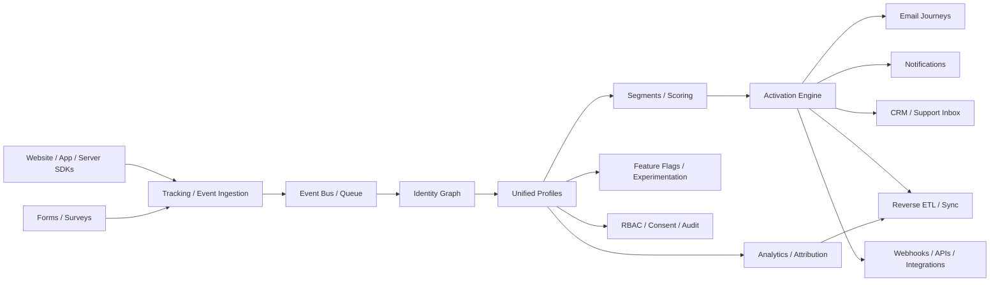

# CDP / CRM / Email Market Research

Snapshot: 2026-06-18  
Method: official GitHub repositories via `gh api`, official repository READMEs, and the two user-provided briefs.  
Note: where I mention typical users, that is an inference from the project focus, not a claim about named customers.

## Executive Summary

The most viable product is not a monolithic CDP and not a microservices-first rewrite. It is a composable customer platform with a narrow core:

- first-party event collection
- identity resolution and profile unification
- segmentation and scoring
- email journeys and transactional sending
- support inbox and omnichannel messaging
- analytics, attribution, and experimentation
- multi-tenant admin, RBAC, consent, and auditability

The strongest open-source references are:

- [PostHog/posthog](https://github.com/PostHog/posthog) for an all-in-one customer platform
- [rudderlabs/rudder-server](https://github.com/rudderlabs/rudder-server) for event collection and routing
- [Tracardi/tracardi](https://github.com/Tracardi/tracardi) for API-first composable CDP behavior
- [knadh/listmonk](https://github.com/knadh/listmonk) for a lean email marketing engine
- [mautic/mautic](https://github.com/mautic/mautic) for marketing automation breadth
- [chatwoot/chatwoot](https://github.com/chatwoot/chatwoot) for support + inbox workflows
- [novuhq/novu](https://github.com/novuhq/novu) for notification abstraction
- [n8n-io/n8n](https://github.com/n8n-io/n8n) and [temporalio/temporal](https://github.com/temporalio/temporal) for orchestration

The big business wedge is owned first-party data, fast deployment, and local support. The big product risk is deliverability and scope creep.

## Market Map

## How The Stack Fits Together

### Capture layer

- Event tracking
- Forms
- Surveys
- SDKs for web, mobile, and server

### Identity and data layer

- Identity resolution
- Customer profile
- CDP
- Reverse ETL
- Event routing

### Activation layer

- Marketing automation
- Email marketing
- Transactional email
- Journey builder
- Lead management and lead scoring
- Personalization

### Relationship layer

- CRM
- Customer success
- Helpdesk
- Live chat
- Omnichannel inbox

### Intelligence layer

- Analytics
- Product analytics
- Marketing attribution
- Feature flags
- Experimentation

### Orchestration layer

- Workflow automation
- Webhooks
- Queues
- Retry and idempotency

### Governance layer

- Multi-tenancy
- RBAC
- Consent
- Suppression lists
- Audit log
- Tenant isolation

## Core Shortlist

### CDP / data infrastructure

- [PostHog/posthog](https://github.com/PostHog/posthog) - 35,081 stars, Python, `NOASSERTION`. Best reference for an integrated customer platform: product analytics, replays, flags, surveys, CDP, and a single UI. Strong benchmark for breadth; not a lightweight starting point.
- [airbytehq/airbyte](https://github.com/airbytehq/airbyte) - 21,492 stars, Python, `NOASSERTION`. Best open-source ELT and sync backbone. Very useful for reverse ETL and warehouse-first activation, but it is not a customer app by itself.
- [snowplow/snowplow](https://github.com/snowplow/snowplow) - 7,013 stars, Scala, Apache-2.0. Strong event/data pipeline reference with a mature customer data infrastructure story.
- [rudderlabs/rudder-server](https://github.com/rudderlabs/rudder-server) - 4,439 stars, Go, `NOASSERTION`. Classic event router / CDP backbone. Great for collection, routing, transforms, and data plumbing.
- [Tracardi/tracardi](https://github.com/Tracardi/tracardi) - 642 stars, Python, `NOASSERTION`. API-first composable CDP engine. Very relevant for identity stitching, orchestration, and low-code activation.
- [apache/unomi](https://github.com/apache/unomi) - 360 stars, Java, Apache-2.0. Apache reference for customer data management and segmentation.
- [meltano/meltano](https://github.com/meltano/meltano) - 2,538 stars, Python, MIT. Strong code-first data integration engine; useful for pipelines and sync tasks.
- [Openpanel-dev/openpanel](https://github.com/Openpanel-dev/openpanel) - 5,952 stars, TypeScript, AGPL-3.0. Open-source web/product analytics and a good lightweight product-intelligence reference.
- [grouparoo/grouparoo](https://github.com/grouparoo/grouparoo) - 775 stars, JavaScript, MIT, archived. Historical customer data sync framework; useful as a design reference, not as an active dependency.

### CRM / customer platform

- [twentyhq/twenty](https://github.com/twentyhq/twenty) - 50,399 stars, TypeScript, `NOASSERTION`. Open alternative to Salesforce. Best current OSS CRM benchmark for modern UX and AI-era positioning.
- [krayin/laravel-crm](https://github.com/krayin/laravel-crm) - 23,006 stars, Blade, MIT. Very strong SMB/enterprise CRM candidate on Laravel; good for practical CRM workflows.
- [frappe/erpnext](https://github.com/frappe/erpnext) - 35,820 stars, Python, GPL-3.0. Huge ERP reference with CRM-adjacent business workflows; powerful but broad.
- [chatwoot/chatwoot](https://github.com/chatwoot/chatwoot) - 32,557 stars, Ruby, `NOASSERTION`. Best support/inbox platform with CRM-adjacent customer context.
- [SuiteCRM/SuiteCRM](https://github.com/SuiteCRM/SuiteCRM) - 5,517 stars, PHP, AGPL-3.0. Mature open-source CRM reference; broad, older architecture, but still relevant.
- [espocrm/espocrm](https://github.com/espocrm/espocrm) - 3,060 stars, PHP, AGPL-3.0. Leaner CRM than SuiteCRM; useful if you want less legacy weight.
- [frappe/crm](https://github.com/frappe/crm) - 2,846 stars, Vue, AGPL-3.0. Modern Frappe CRM surface; good for full-stack business app patterns.
- [erxes/erxes](https://github.com/erxes/erxes) - 4,002 stars, TypeScript, `NOASSERTION`. Experience Operating System that unifies marketing, sales, operations, and support. Very aligned with the “customer platform” idea.
- [oroinc/crm-application](https://github.com/oroinc/crm-application) - 1,001 stars, PHP, `NOASSERTION`. OroCRM is an enterprise CRM baseline.
- [YetiForceCompany/YetiForceCRM](https://github.com/YetiForceCompany/YetiForceCRM) - 1,788 stars, PHP, `NOASSERTION`, archived. Historical enterprise CRM reference only.

### Support / engagement / inbox

- [zammad/zammad](https://github.com/zammad/zammad) - 5,689 stars, Ruby, AGPL-3.0. Excellent helpdesk reference with strong operational depth.
- [freescout-help-desk/freescout](https://github.com/freescout-help-desk/freescout) - 4,348 stars, PHP, AGPL-3.0. Great lightweight shared inbox/helpdesk option.
- [chaskiq/chaskiq](https://github.com/chaskiq/chaskiq) - 3,529 stars, TypeScript, `NOASSERTION`. Live chat, support, and marketing in one; close to Intercom-style convergence.
- [LiveHelperChat/livehelperchat](https://github.com/LiveHelperChat/livehelperchat) - 2,216 stars, PHP, Apache-2.0. Long-running live support option with mobile/voice extensions.
- [opensupports/opensupports](https://github.com/opensupports/opensupports) - 1,034 stars, JavaScript, GPL-3.0. Simpler ticket system; useful as a baseline.
- [Tiledesk/tiledesk](https://github.com/Tiledesk/tiledesk) - 303 stars, Mustache, MIT. Smaller, but relevant for bot/inbox patterns.

### Email marketing / automation / sending

- [knadh/listmonk](https://github.com/knadh/listmonk) - 21,632 stars, Go, AGPL-3.0. Best lean newsletter manager. Excellent product if you want speed, simplicity, and strong deliverability hygiene.
- [mautic/mautic](https://github.com/mautic/mautic) - 9,837 stars, PHP, `NOASSERTION`. The broadest marketing automation OSS reference.
- [Mailtrain-org/mailtrain](https://github.com/Mailtrain-org/mailtrain) - 5,733 stars, JavaScript, GPL-3.0. Self-hosted newsletter app with a practical campaign model.
- [useplunk/plunk](https://github.com/useplunk/plunk) - 5,190 stars, TypeScript, AGPL-3.0. Modern open-source email platform with a productized feel.
- [usesend/useSend](https://github.com/useSend/useSend) - 4,390 stars, TypeScript, AGPL-3.0. Open-source alternative to Resend/Sendgrid/Postmark.
- [pentacent/keila](https://github.com/pentacent/keila) - 2,119 stars, Elixir, AGPL-3.0. Good newsletter-focused tool with a small surface area.
- [mettle/sendportal](https://github.com/mettle/sendportal) - 2,142 stars, PHP, MIT. Straightforward self-hosted email marketing tool.
- [dittofeed/dittofeed](https://github.com/dittofeed/dittofeed) - 2,808 stars, TypeScript, MIT. Open-source customer engagement for transactional and marketing messaging.
- [Notifuse/notifuse](https://github.com/Notifuse/notifuse) - 1,984 stars, Go, `NOASSERTION`. Modern emailing platform; relevant for notification/email abstraction.
- [Billionmail/BillionMail](https://github.com/Billionmail/BillionMail) - 15,150 stars, Go, AGPL-3.0. Interesting all-in-one mailserver/newsletter/email marketing hybrid.
- [postalserver/postal](https://github.com/postalserver/postal) - 16,609 stars, Ruby, MIT. Strong mail delivery platform reference for sending infrastructure.
- [mjmlio/mjml](https://github.com/mjmlio/mjml) - 18,106 stars, JavaScript, MIT. Essential email template framework.
- [phpList/phplist3](https://github.com/phpList/phplist3) - 852 stars, PHP, AGPL-3.0. Old but still useful as a long-lived newsletter manager.

### Analytics / flags / forms / surveys

- [umami-software/umami](https://github.com/umami-software/umami) - 37,218 stars, TypeScript, MIT. Very strong privacy-first analytics benchmark.
- [plausible/analytics](https://github.com/plausible/analytics) - 27,229 stars, Elixir, AGPL-3.0. Excellent cookie-free web analytics reference.
- [matomo-org/matomo](https://github.com/matomo-org/matomo) - 21,609 stars, PHP, GPL-3.0. Mature analytics platform with broad enterprise adoption.
- [growthbook/growthbook](https://github.com/growthbook/growthbook) - 7,895 stars, TypeScript, `NOASSERTION`. Feature flags, experimentation, and product analytics in one.
- [Flagsmith/flagsmith](https://github.com/Flagsmith/flagsmith) - 6,413 stars, Python, BSD-3-Clause. Mature feature-flagging and remote config service.
- [Unleash/unleash](https://github.com/Unleash/unleash) - 13,590 stars, TypeScript, AGPL-3.0. One of the most established feature-management platforms.
- [formbricks/formbricks](https://github.com/formbricks/formbricks) - 12,397 stars, TypeScript, `NOASSERTION`. Strong open-source survey/customer feedback platform.
- [OpnForm/OpnForm](https://github.com/OpnForm/OpnForm) - 3,470 stars, PHP, `NOASSERTION`. Clean open-source form builder.
- [baptisteArno/typebot.io](https://github.com/baptisteArno/typebot.io) - 10,045 stars, TypeScript, `NOASSERTION`. Powerful chatbot/form-flow builder; useful for lead capture and guided journeys.

### Workflow automation / orchestration

- [n8n-io/n8n](https://github.com/n8n-io/n8n) - 193,052 stars, TypeScript, `NOASSERTION`. The biggest workflow automation benchmark in OSS.
- [activepieces/activepieces](https://github.com/activepieces/activepieces) - 22,816 stars, TypeScript, `NOASSERTION`. Modern AI-friendly workflow automation platform.
- [windmill-labs/windmill](https://github.com/windmill-labs/windmill) - 16,812 stars, Rust, `NOASSERTION`. Strong developer platform for turning scripts into workflows.
- [temporalio/temporal](https://github.com/temporalio/temporal) - 21,051 stars, Go, MIT. Best reference for durable workflows and long-running orchestration.

### Notification platform

- [novuhq/novu](https://github.com/novuhq/novu) - 39,148 stars, TypeScript, `NOASSERTION`. Strong open-source communication infrastructure for multi-channel notifications.

## Supporting SDKs And Trackers

These are not the main platforms, but they matter because a serious CDP/email stack is won or lost in the SDK layer.

- [PostHog/posthog-js](https://github.com/PostHog/posthog-js) - 553 stars, TypeScript, `NOASSERTION`. Web SDK and autocapture layer.
- [PostHog/posthog-python](https://github.com/PostHog/posthog-python) - 58 stars, Python, `NOASSERTION`. Python SDK for server-side events.
- [PostHog/posthog-ios](https://github.com/PostHog/posthog-ios) - 102 stars, Swift, `NOASSERTION`. Mobile event collection.
- [PostHog/posthog-android](https://github.com/PostHog/posthog-android) - 83 stars, Kotlin, `NOASSERTION`. Android event collection.
- [rudderlabs/rudder-sdk-js](https://github.com/rudderlabs/rudder-sdk-js) - 175 stars, TypeScript, `NOASSERTION`. Core JS SDK for RudderStack ingestion.
- [rudderlabs/rudder-sdk-node](https://github.com/rudderlabs/rudder-sdk-node) - 7 stars, JavaScript, `NOASSERTION`. Node SDK.
- [rudderlabs/rudder-sdk-ios](https://github.com/rudderlabs/rudder-sdk-ios) - 20 stars, Objective-C, `NOASSERTION`. iOS SDK.
- [rudderlabs/rudder-sdk-android](https://github.com/rudderlabs/rudder-sdk-android) - 18 stars, Java, `NOASSERTION`. Android SDK.
- [snowplow/snowplow-javascript-tracker](https://github.com/snowplow/snowplow-javascript-tracker) - 588 stars, TypeScript, BSD-3-Clause. Strong web tracker.
- [snowplow/snowplow-micro](https://github.com/snowplow/snowplow-micro) - 53 stars, Scala, `NOASSERTION`. Test harness for tracker validation.
- [snowplow/snowplow-android-tracker](https://github.com/snowplow/snowplow-android-tracker) - 120 stars, Kotlin, Apache-2.0. Android tracker.
- [snowplow/snowplow-ios-tracker](https://github.com/snowplow/snowplow-ios-tracker) - 89 stars, Swift, Apache-2.0. iOS tracker.
- [Flagsmith/flagsmith-js-client](https://github.com/Flagsmith/flagsmith-js-client) - 67 stars, TypeScript, BSD-3-Clause. JS client for feature flags.
- [Tracardi/tracardi-js](https://github.com/Tracardi/tracardi-js) - 4 stars, HTML, `None`. Small but relevant for Tracardi frontend/event glue.

## What The Best OSS Projects Teach Us

- [PostHog](https://github.com/PostHog/posthog) shows that the winning product shape is broader than a CDP. It combines analytics, flags, surveys, replays, and CDP-like data context.
- [RudderStack](https://github.com/rudderlabs/rudder-server) shows that event collection and routing are a separate problem from activation and UI.
- [Tracardi](https://github.com/Tracardi/tracardi) shows the value of API-first composable automation around identities and profiles.
- [listmonk](https://github.com/knadh/listmonk) shows that a narrow email product can still feel premium if it is fast and simple.
- [Mautic](https://github.com/mautic/mautic) shows the power and the cost of breadth.
- [Chatwoot](https://github.com/chatwoot/chatwoot) shows the market pull of an omnichannel inbox with CRM context.
- [Novu](https://github.com/novuhq/novu) shows that notifications are better treated as an abstraction layer than a pile of one-off integrations.
- [n8n](https://github.com/n8n-io/n8n) and [Temporal](https://github.com/temporalio/temporal) show how to separate orchestration from domain logic.

## Email Platform Architecture

The brief is right to focus on deliverability, because this is where many “email products” quietly fail.

### Core building blocks

- Lists and audiences
- Static segments
- Dynamic segments
- Subscriptions and preferences
- Suppression lists
- Bounces and complaints
- Double opt-in
- Unsubscribe management
- Templates and reusable blocks
- Personalization and merge tags
- Journeys, drips, and triggers
- APIs, webhooks, and provider adapters
- Tracking pixels, click tracking, open tracking, and UTM propagation

### What OSS already covers well

- [listmonk](https://github.com/knadh/listmonk): lists, campaigns, segmentation, templates, analytics
- [Mautic](https://github.com/mautic/mautic): journeys, scoring, campaign logic, forms, broad automation
- [Mailtrain](https://github.com/Mailtrain-org/mailtrain): newsletter management and campaign flows
- [Plunk](https://github.com/useplunk/plunk): modern email platform UX
- [Keila](https://github.com/pentacent/keila): simple newsletter tool
- [Postal](https://github.com/postalserver/postal): sending infrastructure
- [MJML](https://github.com/mjmlio/mjml): responsive email authoring
- [Dittofeed](https://github.com/dittofeed/dittofeed): engagement and triggered messaging

### What is still weak or fragmented

- Deep deliverability intelligence
- Spam-trap and inbox-placement tooling
- Advanced journey UX comparable to Customer.io or Klaviyo
- Native multi-brand / multi-tenant governance
- Full-stack revenue attribution
- Rich AI-assisted segmentation and content generation

### Deliverability rules that matter

- Authenticate every sending domain with SPF, DKIM, and DMARC
- Use BIMI only after DMARC is stable
- Warm new IPs gradually
- Protect reputation with suppression lists and list hygiene
- Separate transactional and marketing traffic
- Make retries idempotent
- Track provider-level bounces and complaints centrally

## CDP / Identity / Multi-Tenancy Architecture

### Identity graph

Identity resolution should connect:

- `anonymous_id`
- `email`
- `phone`
- `user_id`
- `crm_id`
- device/browser fingerprints where legally and ethically allowed

The winning model is usually deterministic first, probabilistic only when you have to.

### Multi-tenancy

The user-provided brief is also right about the tenancy tradeoff:

- `shared schema` is cheapest and fastest to operate
- `database per tenant` is safest and simplest to reason about for regulated clients
- `hybrid` is the practical commercial answer

For a sellable product, the default should be hybrid:

- shared control plane
- tenant-aware data plane
- optional isolated databases for enterprise clients
- queue partitioning by tenant
- audit logs and tenant-scoped encryption keys where needed

### Why not microservices?

Composable does not mean microservices-first.

Microservices are a bad first answer here because:

- identity stitching and suppression rules need shared invariants
- email state is full of edge cases and retries
- cross-service consistency is hard to keep correct
- observability and operations cost rise fast
- early product iteration slows down

The better pattern is:

- modular monolith for the core product
- async workers for ingest, sending, sync, and scoring
- service extraction only when a domain has a clear scale boundary

Extract first when you have one of these:

- very high-volume event ingest
- heavy send/queue throughput
- search/index workloads
- isolated compliance or tenancy requirements

## Recommended Build Order

1. Event collector + SDKs.
2. Identity merge + unified profile.
3. Segmentation + suppression + consent.
4. Email campaign builder + MJML templates.
5. One reliable sending provider and delivery tracking.
6. Basic automation: welcome, abandon, re-engagement.
7. Tenant management + RBAC + audit log.
8. Support inbox and omnichannel layer.
9. Workflow automation and integrations marketplace.
10. Analytics, attribution, flags, and experimentation.

## Commercial Wedge

Best initial buyers are teams that already need:

- first-party data ownership
- data residency or self-hosting
- faster deployment than HubSpot-style implementations
- custom integrations
- email automation without vendor lock-in

The sharpest wedge is not “we are a better HubSpot.”
The sharpest wedge is “we are a composable customer operating system that fits your stack and your data rules.”

## Key Gaps In OSS

- No single OSS project yet matches HubSpot + Customer.io + Intercom + Klaviyo in one package
- Reverse ETL is still weaker than the commercial market
- Multi-channel orchestration beyond email is fragmented
- Deliverability operations are under-modeled
- Enterprise admin, billing, and tenant provisioning are usually bolted on later
- AI features are growing, but mostly as add-ons, not the core product

## Ready-To-Use Deep Research Prompt

Use this if you want to continue the research elsewhere:

> Проведи максимально глубокое исследование мирового рынка open-source customer platforms, CDP, CRM, email marketing, marketing automation, support inbox, analytics, feature flags, forms, workflow automation и identity resolution.  
> Для каждой категории:
> - найди лучшие GitHub-репозитории
> - укажи stars, language, license, activity, architecture, strengths, weaknesses, typical users
> - отдельно выдели archived / stale / risky projects
> - разберись, как устроены email lists, segments, suppression, bounce, complaint handling, double opt-in, templates, MJML, deliverability, queues, idempotency, tracking, journeys и provider abstraction
> - сравни composable CDP, traditional CDP и warehouse-first подходы
> - объясни multi-tenancy patterns and trade-offs
> - собери top-100 repo list и top-50 most useful repos
> - заверши рекомендацией, как построить sellable open-source customer platform for SMB and enterprise

## Source Links

Primary GitHub sources used in this synthesis:

- [PostHog/posthog](https://github.com/PostHog/posthog)
- [rudderlabs/rudder-server](https://github.com/rudderlabs/rudder-server)
- [Tracardi/tracardi](https://github.com/Tracardi/tracardi)
- [knadh/listmonk](https://github.com/knadh/listmonk)
- [mautic/mautic](https://github.com/mautic/mautic)
- [chatwoot/chatwoot](https://github.com/chatwoot/chatwoot)
- [novuhq/novu](https://github.com/novuhq/novu)
- [n8n-io/n8n](https://github.com/n8n-io/n8n)
- [temporalio/temporal](https://github.com/temporalio/temporal)
- [twentyhq/twenty](https://github.com/twentyhq/twenty)
- [krayin/laravel-crm](https://github.com/krayin/laravel-crm)
- [chatwoot/chatwoot](https://github.com/chatwoot/chatwoot)
- [zammad/zammad](https://github.com/zammad/zammad)
- [airbytehq/airbyte](https://github.com/airbytehq/airbyte)
- [meltano/meltano](https://github.com/meltano/meltano)
- [plausible/analytics](https://github.com/plausible/analytics)
- [matomo-org/matomo](https://github.com/matomo-org/matomo)
- [umami-software/umami](https://github.com/umami-software/umami)
- [growthbook/growthbook](https://github.com/growthbook/growthbook)
- [Flagsmith/flagsmith](https://github.com/Flagsmith/flagsmith)
- [Unleash/unleash](https://github.com/Unleash/unleash)
- [formbricks/formbricks](https://github.com/formbricks/formbricks)
- [OpnForm/OpnForm](https://github.com/OpnForm/OpnForm)
